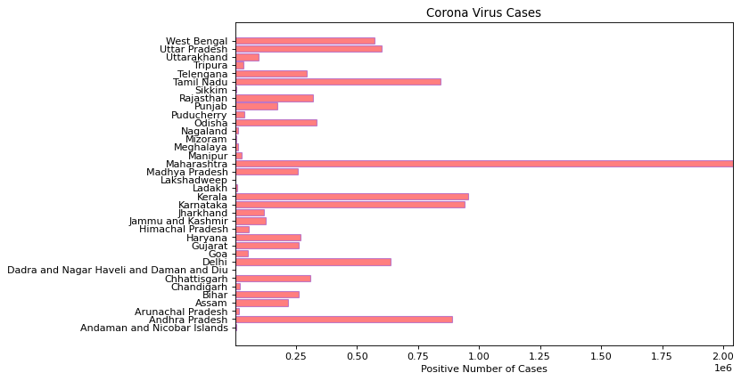

# Corona Virus Live Tracking For India


```python
import pandas as pd
df = pd.read_json('https://www.mohfw.gov.in/data/datanew.json')
df
```


<div>
<style scoped>
    .dataframe tbody tr th:only-of-type {
        vertical-align: middle;
    }

    .dataframe tbody tr th {
        vertical-align: top;
    }

    .dataframe thead th {
        text-align: right;
    }
</style>
<table border="1" class="dataframe">
  <thead>
    <tr style="text-align: right;">
      <th></th>
      <th>sno</th>
      <th>state_name</th>
      <th>active</th>
      <th>positive</th>
      <th>cured</th>
      <th>death</th>
      <th>new_active</th>
      <th>new_positive</th>
      <th>new_cured</th>
      <th>new_death</th>
      <th>state_code</th>
    </tr>
  </thead>
  <tbody>
    <tr>
      <th>0</th>
      <td>2</td>
      <td>Andaman and Nicobar Islands</td>
      <td>3</td>
      <td>4997</td>
      <td>4932</td>
      <td>62</td>
      <td>6</td>
      <td>5000</td>
      <td>4932</td>
      <td>62</td>
      <td>35</td>
    </tr>
    <tr>
      <th>1</th>
      <td>1</td>
      <td>Andhra Pradesh</td>
      <td>1071</td>
      <td>888275</td>
      <td>880046</td>
      <td>7158</td>
      <td>1012</td>
      <td>888350</td>
      <td>880179</td>
      <td>7159</td>
      <td>28</td>
    </tr>
    <tr>
      <th>2</th>
      <td>3</td>
      <td>Arunachal Pradesh</td>
      <td>8</td>
      <td>16829</td>
      <td>16765</td>
      <td>56</td>
      <td>7</td>
      <td>16830</td>
      <td>16767</td>
      <td>56</td>
      <td>12</td>
    </tr>
    <tr>
      <th>3</th>
      <td>4</td>
      <td>Assam</td>
      <td>1706</td>
      <td>217193</td>
      <td>214403</td>
      <td>1084</td>
      <td>1695</td>
      <td>217202</td>
      <td>214423</td>
      <td>1084</td>
      <td>18</td>
    </tr>
    <tr>
      <th>4</th>
      <td>5</td>
      <td>Bihar</td>
      <td>608</td>
      <td>260034</td>
      <td>257914</td>
      <td>1512</td>
      <td>609</td>
      <td>260095</td>
      <td>257971</td>
      <td>1515</td>
      <td>10</td>
    </tr>
    <tr>
      <th>5</th>
      <td>6</td>
      <td>Chandigarh</td>
      <td>187</td>
      <td>21060</td>
      <td>20535</td>
      <td>338</td>
      <td>184</td>
      <td>21088</td>
      <td>20565</td>
      <td>339</td>
      <td>04</td>
    </tr>
    <tr>
      <th>6</th>
      <td>7</td>
      <td>Chhattisgarh</td>
      <td>4360</td>
      <td>307079</td>
      <td>298987</td>
      <td>3732</td>
      <td>4320</td>
      <td>307339</td>
      <td>299284</td>
      <td>3735</td>
      <td>22</td>
    </tr>
    <tr>
      <th>7</th>
      <td>8</td>
      <td>Dadra and Nagar Haveli and Daman and Diu</td>
      <td>2</td>
      <td>3398</td>
      <td>3394</td>
      <td>2</td>
      <td>1</td>
      <td>3398</td>
      <td>3395</td>
      <td>2</td>
      <td>26</td>
    </tr>
    <tr>
      <th>8</th>
      <td>10</td>
      <td>Delhi</td>
      <td>1206</td>
      <td>635793</td>
      <td>623714</td>
      <td>10873</td>
      <td>1174</td>
      <td>635916</td>
      <td>623865</td>
      <td>10877</td>
      <td>07</td>
    </tr>
    <tr>
      <th>9</th>
      <td>11</td>
      <td>Goa</td>
      <td>760</td>
      <td>53773</td>
      <td>52243</td>
      <td>770</td>
      <td>769</td>
      <td>53838</td>
      <td>52299</td>
      <td>770</td>
      <td>30</td>
    </tr>
    <tr>
      <th>10</th>
      <td>12</td>
      <td>Gujarat</td>
      <td>2641</td>
      <td>262948</td>
      <td>255914</td>
      <td>4393</td>
      <td>2491</td>
      <td>263200</td>
      <td>256315</td>
      <td>4394</td>
      <td>24</td>
    </tr>
    <tr>
      <th>11</th>
      <td>13</td>
      <td>Haryana</td>
      <td>949</td>
      <td>268293</td>
      <td>264317</td>
      <td>3027</td>
      <td>908</td>
      <td>268364</td>
      <td>264429</td>
      <td>3027</td>
      <td>06</td>
    </tr>
    <tr>
      <th>12</th>
      <td>14</td>
      <td>Himachal Pradesh</td>
      <td>462</td>
      <td>57764</td>
      <td>56320</td>
      <td>982</td>
      <td>497</td>
      <td>57851</td>
      <td>56371</td>
      <td>983</td>
      <td>02</td>
    </tr>
    <tr>
      <th>13</th>
      <td>15</td>
      <td>Jammu and Kashmir</td>
      <td>654</td>
      <td>124785</td>
      <td>122187</td>
      <td>1944</td>
      <td>631</td>
      <td>124850</td>
      <td>122275</td>
      <td>1944</td>
      <td>01</td>
    </tr>
    <tr>
      <th>14</th>
      <td>16</td>
      <td>Jharkhand</td>
      <td>441</td>
      <td>118938</td>
      <td>117420</td>
      <td>1077</td>
      <td>428</td>
      <td>118979</td>
      <td>117474</td>
      <td>1077</td>
      <td>20</td>
    </tr>
    <tr>
      <th>15</th>
      <td>17</td>
      <td>Karnataka</td>
      <td>5893</td>
      <td>941500</td>
      <td>923377</td>
      <td>12230</td>
      <td>5987</td>
      <td>942031</td>
      <td>923811</td>
      <td>12233</td>
      <td>29</td>
    </tr>
    <tr>
      <th>16</th>
      <td>18</td>
      <td>Kerala</td>
      <td>68047</td>
      <td>956421</td>
      <td>884542</td>
      <td>3832</td>
      <td>67795</td>
      <td>962363</td>
      <td>890720</td>
      <td>3848</td>
      <td>32</td>
    </tr>
    <tr>
      <th>17</th>
      <td>19</td>
      <td>Ladakh</td>
      <td>72</td>
      <td>9743</td>
      <td>9541</td>
      <td>130</td>
      <td>72</td>
      <td>9744</td>
      <td>9542</td>
      <td>130</td>
      <td>37</td>
    </tr>
    <tr>
      <th>18</th>
      <td>20</td>
      <td>Lakshadweep</td>
      <td>76</td>
      <td>141</td>
      <td>65</td>
      <td>0</td>
      <td>86</td>
      <td>151</td>
      <td>65</td>
      <td>0</td>
      <td>31</td>
    </tr>
    <tr>
      <th>19</th>
      <td>21</td>
      <td>Madhya Pradesh</td>
      <td>2193</td>
      <td>256017</td>
      <td>250005</td>
      <td>3819</td>
      <td>2074</td>
      <td>256214</td>
      <td>250320</td>
      <td>3820</td>
      <td>23</td>
    </tr>
    <tr>
      <th>20</th>
      <td>22</td>
      <td>Maharashtra</td>
      <td>35188</td>
      <td>2038630</td>
      <td>1952187</td>
      <td>51255</td>
      <td>36192</td>
      <td>2041398</td>
      <td>1953926</td>
      <td>51280</td>
      <td>27</td>
    </tr>
    <tr>
      <th>21</th>
      <td>23</td>
      <td>Manipur</td>
      <td>113</td>
      <td>29110</td>
      <td>28625</td>
      <td>372</td>
      <td>109</td>
      <td>29117</td>
      <td>28636</td>
      <td>372</td>
      <td>14</td>
    </tr>
    <tr>
      <th>22</th>
      <td>24</td>
      <td>Meghalaya</td>
      <td>81</td>
      <td>13821</td>
      <td>13593</td>
      <td>147</td>
      <td>102</td>
      <td>13845</td>
      <td>13596</td>
      <td>147</td>
      <td>17</td>
    </tr>
    <tr>
      <th>23</th>
      <td>25</td>
      <td>Mizoram</td>
      <td>27</td>
      <td>4381</td>
      <td>4345</td>
      <td>9</td>
      <td>23</td>
      <td>4382</td>
      <td>4350</td>
      <td>9</td>
      <td>15</td>
    </tr>
    <tr>
      <th>24</th>
      <td>26</td>
      <td>Nagaland</td>
      <td>68</td>
      <td>12126</td>
      <td>11970</td>
      <td>88</td>
      <td>85</td>
      <td>12148</td>
      <td>11975</td>
      <td>88</td>
      <td>13</td>
    </tr>
    <tr>
      <th>25</th>
      <td>27</td>
      <td>Odisha</td>
      <td>825</td>
      <td>335466</td>
      <td>332733</td>
      <td>1908</td>
      <td>797</td>
      <td>335548</td>
      <td>332842</td>
      <td>1909</td>
      <td>21</td>
    </tr>
    <tr>
      <th>26</th>
      <td>28</td>
      <td>Puducherry</td>
      <td>314</td>
      <td>39235</td>
      <td>38267</td>
      <td>654</td>
      <td>317</td>
      <td>39270</td>
      <td>38299</td>
      <td>654</td>
      <td>34</td>
    </tr>
    <tr>
      <th>27</th>
      <td>29</td>
      <td>Punjab</td>
      <td>2144</td>
      <td>174256</td>
      <td>166477</td>
      <td>5635</td>
      <td>2156</td>
      <td>174439</td>
      <td>166643</td>
      <td>5640</td>
      <td>03</td>
    </tr>
    <tr>
      <th>28</th>
      <td>30</td>
      <td>Rajasthan</td>
      <td>1581</td>
      <td>318021</td>
      <td>313669</td>
      <td>2771</td>
      <td>1527</td>
      <td>318118</td>
      <td>313819</td>
      <td>2772</td>
      <td>08</td>
    </tr>
    <tr>
      <th>29</th>
      <td>31</td>
      <td>Sikkim</td>
      <td>77</td>
      <td>6105</td>
      <td>5893</td>
      <td>135</td>
      <td>75</td>
      <td>6108</td>
      <td>5898</td>
      <td>135</td>
      <td>11</td>
    </tr>
    <tr>
      <th>30</th>
      <td>32</td>
      <td>Tamil Nadu</td>
      <td>4446</td>
      <td>840849</td>
      <td>824024</td>
      <td>12379</td>
      <td>4417</td>
      <td>841326</td>
      <td>824527</td>
      <td>12382</td>
      <td>33</td>
    </tr>
    <tr>
      <th>31</th>
      <td>34</td>
      <td>Telengana</td>
      <td>1977</td>
      <td>295431</td>
      <td>291846</td>
      <td>1608</td>
      <td>1939</td>
      <td>295581</td>
      <td>292032</td>
      <td>1610</td>
      <td>36</td>
    </tr>
    <tr>
      <th>32</th>
      <td>33</td>
      <td>Tripura</td>
      <td>11</td>
      <td>33352</td>
      <td>32950</td>
      <td>391</td>
      <td>11</td>
      <td>33352</td>
      <td>32950</td>
      <td>391</td>
      <td>16</td>
    </tr>
    <tr>
      <th>33</th>
      <td>35</td>
      <td>Uttarakhand</td>
      <td>945</td>
      <td>96431</td>
      <td>93824</td>
      <td>1662</td>
      <td>937</td>
      <td>96478</td>
      <td>93877</td>
      <td>1664</td>
      <td>05</td>
    </tr>
    <tr>
      <th>34</th>
      <td>36</td>
      <td>Uttar Pradesh</td>
      <td>4462</td>
      <td>601128</td>
      <td>587984</td>
      <td>8682</td>
      <td>4438</td>
      <td>601272</td>
      <td>588148</td>
      <td>8686</td>
      <td>09</td>
    </tr>
    <tr>
      <th>35</th>
      <td>37</td>
      <td>West Bengal</td>
      <td>4992</td>
      <td>570981</td>
      <td>555788</td>
      <td>10201</td>
      <td>4895</td>
      <td>571178</td>
      <td>556081</td>
      <td>10202</td>
      <td>19</td>
    </tr>
    <tr>
      <th>36</th>
      <td>11111</td>
      <td></td>
      <td>148590</td>
      <td>10814304</td>
      <td>10510796</td>
      <td>154918</td>
      <td>148766</td>
      <td>10826363</td>
      <td>10522601</td>
      <td>154996</td>
      <td></td>
    </tr>
  </tbody>
</table>
</div>


```python
df=df.iloc[:-1,1:]
```


```python
df.head()
```


<div>
<style scoped>
    .dataframe tbody tr th:only-of-type {
        vertical-align: middle;
    }

    .dataframe tbody tr th {
        vertical-align: top;
    }

    .dataframe thead th {
        text-align: right;
    }
</style>
<table border="1" class="dataframe">
  <thead>
    <tr style="text-align: right;">
      <th></th>
      <th>state_name</th>
      <th>active</th>
      <th>positive</th>
      <th>cured</th>
      <th>death</th>
      <th>new_active</th>
      <th>new_positive</th>
      <th>new_cured</th>
      <th>new_death</th>
      <th>state_code</th>
    </tr>
  </thead>
  <tbody>
    <tr>
      <th>0</th>
      <td>Andaman and Nicobar Islands</td>
      <td>3</td>
      <td>4997</td>
      <td>4932</td>
      <td>62</td>
      <td>6</td>
      <td>5000</td>
      <td>4932</td>
      <td>62</td>
      <td>35</td>
    </tr>
    <tr>
      <th>1</th>
      <td>Andhra Pradesh</td>
      <td>1071</td>
      <td>888275</td>
      <td>880046</td>
      <td>7158</td>
      <td>1012</td>
      <td>888350</td>
      <td>880179</td>
      <td>7159</td>
      <td>28</td>
    </tr>
    <tr>
      <th>2</th>
      <td>Arunachal Pradesh</td>
      <td>8</td>
      <td>16829</td>
      <td>16765</td>
      <td>56</td>
      <td>7</td>
      <td>16830</td>
      <td>16767</td>
      <td>56</td>
      <td>12</td>
    </tr>
    <tr>
      <th>3</th>
      <td>Assam</td>
      <td>1706</td>
      <td>217193</td>
      <td>214403</td>
      <td>1084</td>
      <td>1695</td>
      <td>217202</td>
      <td>214423</td>
      <td>1084</td>
      <td>18</td>
    </tr>
    <tr>
      <th>4</th>
      <td>Bihar</td>
      <td>608</td>
      <td>260034</td>
      <td>257914</td>
      <td>1512</td>
      <td>609</td>
      <td>260095</td>
      <td>257971</td>
      <td>1515</td>
      <td>10</td>
    </tr>
  </tbody>
</table>
</div>


```python
df.tail()
```


<div>
<style scoped>
    .dataframe tbody tr th:only-of-type {
        vertical-align: middle;
    }

    .dataframe tbody tr th {
        vertical-align: top;
    }

    .dataframe thead th {
        text-align: right;
    }
</style>
<table border="1" class="dataframe">
  <thead>
    <tr style="text-align: right;">
      <th></th>
      <th>state_name</th>
      <th>active</th>
      <th>positive</th>
      <th>cured</th>
      <th>death</th>
      <th>new_active</th>
      <th>new_positive</th>
      <th>new_cured</th>
      <th>new_death</th>
      <th>state_code</th>
    </tr>
  </thead>
  <tbody>
    <tr>
      <th>31</th>
      <td>Telengana</td>
      <td>1977</td>
      <td>295431</td>
      <td>291846</td>
      <td>1608</td>
      <td>1939</td>
      <td>295581</td>
      <td>292032</td>
      <td>1610</td>
      <td>36</td>
    </tr>
    <tr>
      <th>32</th>
      <td>Tripura</td>
      <td>11</td>
      <td>33352</td>
      <td>32950</td>
      <td>391</td>
      <td>11</td>
      <td>33352</td>
      <td>32950</td>
      <td>391</td>
      <td>16</td>
    </tr>
    <tr>
      <th>33</th>
      <td>Uttarakhand</td>
      <td>945</td>
      <td>96431</td>
      <td>93824</td>
      <td>1662</td>
      <td>937</td>
      <td>96478</td>
      <td>93877</td>
      <td>1664</td>
      <td>05</td>
    </tr>
    <tr>
      <th>34</th>
      <td>Uttar Pradesh</td>
      <td>4462</td>
      <td>601128</td>
      <td>587984</td>
      <td>8682</td>
      <td>4438</td>
      <td>601272</td>
      <td>588148</td>
      <td>8686</td>
      <td>09</td>
    </tr>
    <tr>
      <th>35</th>
      <td>West Bengal</td>
      <td>4992</td>
      <td>570981</td>
      <td>555788</td>
      <td>10201</td>
      <td>4895</td>
      <td>571178</td>
      <td>556081</td>
      <td>10202</td>
      <td>19</td>
    </tr>
  </tbody>
</table>
</div>


```python
import matplotlib.pyplot as plt
%matplotlib inline
import numpy as np
total_states = np.arange(len(df['state_name']))
```


```python
total_states
```


    array([ 0,  1,  2,  3,  4,  5,  6,  7,  8,  9, 10, 11, 12, 13, 14, 15, 16,
           17, 18, 19, 20, 21, 22, 23, 24, 25, 26, 27, 28, 29, 30, 31, 32, 33,
           34, 35])


```python
df['active']
```


    0         3
    1      1071
    2         8
    3      1706
    4       608
    5       187
    6      4360
    7         2
    8      1206
    9       760
    10     2641
    11      949
    12      462
    13      654
    14      441
    15     5893
    16    68047
    17       72
    18       76
    19     2193
    20    35188
    21      113
    22       81
    23       27
    24       68
    25      825
    26      314
    27     2144
    28     1581
    29       77
    30     4446
    31     1977
    32       11
    33      945
    34     4462
    35     4992
    Name: active, dtype: int64


```python
max(df['positive'])
```


    2038630


# Total Positive Cases Based On States In India


```python
from matplotlib.pyplot import figure
figure(num=None, figsize=(9, 6), dpi=80, facecolor='w', edgecolor='k')
plt.barh(total_states,df['positive'], align='center', alpha=0.5,  
                 color=(1,0,0),  
                 edgecolor=(0.5,0.2,0.8))
    
plt.yticks(total_states, df['state_name'])  
plt.xlim(1,max(df['positive'])+100) 
plt.xlabel('Positive Number of Cases')  
plt.title('Corona Virus Cases')  
plt.show()
```


    

    


# Active Number Of Cases Based On States 


```python
from matplotlib.pyplot import figure
figure(num=None, figsize=(9, 6), dpi=80, facecolor='w', edgecolor='k')
plt.barh(total_states,df['new_active'], align='center', alpha=0.5,  
                 color=(1,0.5,0),  
                 edgecolor=(0.5,0.4,0.8)  )
    
plt.yticks(total_states, df['state_name'])  
plt.xlim(1,max(df['new_active'])+10) 
plt.xlabel('Active Number of Cases')  
plt.title('Corona Virus Cases')  
plt.show()
```


    

    


# Death Number Of Cases Based On States


```python
from matplotlib.pyplot import figure
figure(num=None, figsize=(9, 6), dpi=80, facecolor='w', edgecolor='k')
plt.barh(total_states,df['death'], align='center', alpha=0.5,  
                 color=(0,0,1),  
                 edgecolor=(0.5,0.4,0.8)  )
    
plt.yticks(total_states, df['state_name'])  
plt.xlim(1,max(df['death'])+10) 
plt.xlabel('Death Number of Cases')  
plt.title('Corona Virus Cases')  
plt.show()
```


    

    


# Stack All The  Columns In The Bar Chart 


```python
df.columns
```


    Index(['state_name', 'active', 'positive', 'cured', 'death', 'new_active',
           'new_positive', 'new_cured', 'new_death', 'state_code'],
          dtype='object')


```python
df=df.set_index('state_name',drop=True)
```


```python
df.head()
```


<div>
<style scoped>
    .dataframe tbody tr th:only-of-type {
        vertical-align: middle;
    }

    .dataframe tbody tr th {
        vertical-align: top;
    }

    .dataframe thead th {
        text-align: right;
    }
</style>
<table border="1" class="dataframe">
  <thead>
    <tr style="text-align: right;">
      <th></th>
      <th>active</th>
      <th>positive</th>
      <th>cured</th>
      <th>death</th>
      <th>new_active</th>
      <th>new_positive</th>
      <th>new_cured</th>
      <th>new_death</th>
      <th>state_code</th>
    </tr>
    <tr>
      <th>state_name</th>
      <th></th>
      <th></th>
      <th></th>
      <th></th>
      <th></th>
      <th></th>
      <th></th>
      <th></th>
      <th></th>
    </tr>
  </thead>
  <tbody>
    <tr>
      <th>Andaman and Nicobar Islands</th>
      <td>3</td>
      <td>4997</td>
      <td>4932</td>
      <td>62</td>
      <td>6</td>
      <td>5000</td>
      <td>4932</td>
      <td>62</td>
      <td>35</td>
    </tr>
    <tr>
      <th>Andhra Pradesh</th>
      <td>1071</td>
      <td>888275</td>
      <td>880046</td>
      <td>7158</td>
      <td>1012</td>
      <td>888350</td>
      <td>880179</td>
      <td>7159</td>
      <td>28</td>
    </tr>
    <tr>
      <th>Arunachal Pradesh</th>
      <td>8</td>
      <td>16829</td>
      <td>16765</td>
      <td>56</td>
      <td>7</td>
      <td>16830</td>
      <td>16767</td>
      <td>56</td>
      <td>12</td>
    </tr>
    <tr>
      <th>Assam</th>
      <td>1706</td>
      <td>217193</td>
      <td>214403</td>
      <td>1084</td>
      <td>1695</td>
      <td>217202</td>
      <td>214423</td>
      <td>1084</td>
      <td>18</td>
    </tr>
    <tr>
      <th>Bihar</th>
      <td>608</td>
      <td>260034</td>
      <td>257914</td>
      <td>1512</td>
      <td>609</td>
      <td>260095</td>
      <td>257971</td>
      <td>1515</td>
      <td>10</td>
    </tr>
  </tbody>
</table>
</div>


```python
df.tail()
```


<div>
<style scoped>
    .dataframe tbody tr th:only-of-type {
        vertical-align: middle;
    }

    .dataframe tbody tr th {
        vertical-align: top;
    }

    .dataframe thead th {
        text-align: right;
    }
</style>
<table border="1" class="dataframe">
  <thead>
    <tr style="text-align: right;">
      <th></th>
      <th>active</th>
      <th>positive</th>
      <th>cured</th>
      <th>death</th>
      <th>new_active</th>
      <th>new_positive</th>
      <th>new_cured</th>
      <th>new_death</th>
      <th>state_code</th>
    </tr>
    <tr>
      <th>state_name</th>
      <th></th>
      <th></th>
      <th></th>
      <th></th>
      <th></th>
      <th></th>
      <th></th>
      <th></th>
      <th></th>
    </tr>
  </thead>
  <tbody>
    <tr>
      <th>Telengana</th>
      <td>1977</td>
      <td>295431</td>
      <td>291846</td>
      <td>1608</td>
      <td>1939</td>
      <td>295581</td>
      <td>292032</td>
      <td>1610</td>
      <td>36</td>
    </tr>
    <tr>
      <th>Tripura</th>
      <td>11</td>
      <td>33352</td>
      <td>32950</td>
      <td>391</td>
      <td>11</td>
      <td>33352</td>
      <td>32950</td>
      <td>391</td>
      <td>16</td>
    </tr>
    <tr>
      <th>Uttarakhand</th>
      <td>945</td>
      <td>96431</td>
      <td>93824</td>
      <td>1662</td>
      <td>937</td>
      <td>96478</td>
      <td>93877</td>
      <td>1664</td>
      <td>05</td>
    </tr>
    <tr>
      <th>Uttar Pradesh</th>
      <td>4462</td>
      <td>601128</td>
      <td>587984</td>
      <td>8682</td>
      <td>4438</td>
      <td>601272</td>
      <td>588148</td>
      <td>8686</td>
      <td>09</td>
    </tr>
    <tr>
      <th>West Bengal</th>
      <td>4992</td>
      <td>570981</td>
      <td>555788</td>
      <td>10201</td>
      <td>4895</td>
      <td>571178</td>
      <td>556081</td>
      <td>10202</td>
      <td>19</td>
    </tr>
  </tbody>
</table>
</div>


```python
### Plotting Based on Stacking
df.plot.barh(stacked=True,figsize=(10,10)) 
```


    <matplotlib.axes._subplots.AxesSubplot at 0x1eef6504c70>


    

    


```python
df1=df.iloc[:,1:3]
df1.plot.barh(color={"cured": "red", "positive": "green"},figsize=(10,10))
```


    <matplotlib.axes._subplots.AxesSubplot at 0x1eef7310490>


    

    


```python

```
